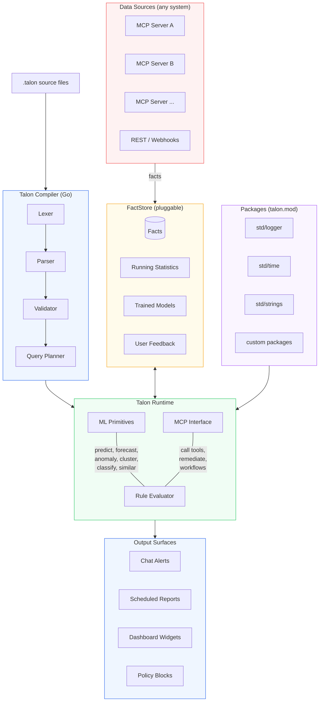
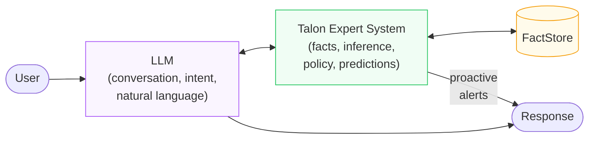

# Talon

**A domain-agnostic expert system language with built-in ML primitives.**

[](https://github.com/opentalon/talon-language/actions/workflows/ci.yml)
[](LICENSE)
[](https://go.dev)

---

Talon introduces a new concept: **Expert-in-the-Loop**. Instead of a human reviewing every AI decision, a deterministic expert system sits alongside the LLM — reasoning over facts, enforcing policies, and predicting outcomes. The LLM handles conversation and intent. Talon handles knowledge and inference. They work together.

## What is Talon?

Talon is a rule language for building expert systems. It reasons over structured facts from any data source — inventory, CRM, ERP, IoT sensors, ticketing systems, or anything that produces structured data. Rules detect patterns, enforce policies, predict outcomes, and automate workflows.

Talon is:
- **Domain-agnostic** — works for fleet management, construction, supply chain, HR compliance, hospitality, sales optimization, or any domain with structured data.
- **Readable** — rules look like English. A domain expert can read, write, and audit them without programming experience.
- **Adaptive** — thresholds learn from each tenant's own data. Rules get smarter over time.
- **Deterministic** — detections are explainable and auditable. No black-box predictions.
- **Testable** — rules have their own test framework (`.talon.test` files).

## Example

A construction site is burning through cement faster than expected. Talon detects it, forecasts when stock hits zero, and tells procurement exactly how much to order:

```talon
detect "Cement running low" {
  for records where type == "stock_item"
    and attr "name" == "Portland Cement 50kg"
    and attr "current_stock" <= attr "minimum_amount"
    and status == "active"
  flag matching items
  label "{item.name}: {attr.current_stock} bags left (minimum: {attr.minimum_amount})"
  priority CRITICAL
}

forecast "Cement stock-out date" {
  for records where type == "stock_item"
    and attr "name" == "Portland Cement 50kg"
  series attr "current_stock" over last 30 days
  predict days_until value <= 0
  when days_until < 7
  label "{item.name}: stock hits zero in ~{days_until} days at current usage"
  priority CRITICAL
}

recommend "Order cement" {
  when detect "Cement running low" matches
  calculate avg_weekly from activities
    where type == "consume" within last 30 days
  suggest "Order {avg_weekly * 4 - attr.current_stock} bags of {item.name}
           to cover 4 weeks at current consumption (~{avg_weekly}/week)"
}
```

No LLM involved. No API calls to figure out what's running low. Talon watches the data and tells you before the site stops.

## Installation

### Prebuilt binaries (recommended)

Each tagged release publishes a `talon` binary for linux/amd64, linux/arm64, darwin/amd64, darwin/arm64, and windows/amd64. Grab one from the [Releases page](https://github.com/opentalon/talon-language/releases) or use the snippet for your platform:

```bash
# macOS (Apple Silicon) — adjust the URL for linux/x86_64 etc.
TAG=$(curl -sL https://api.github.com/repos/opentalon/talon-language/releases/latest | grep '"tag_name"' | cut -d '"' -f 4)
curl -fsSL "https://github.com/opentalon/talon-language/releases/download/${TAG}/talon-${TAG}-darwin-arm64.tar.gz" \
  | tar -xz
./talon version
```

Every release ships with a `SHA256SUMS.txt` file in case you want to verify the download.

### From source

If you already have Go 1.25+ installed:

```bash
go install github.com/opentalon/talon-language/cmd/talon@latest
talon version
```

### Try the REPL

The fastest way to see Talon in action — load a real example, evaluate every
block, and trace one to see the per-step query plan:

```bash
talon repl
talon> :load examples/insurance_claims.talon
  loaded examples/insurance_claims.talon: 5 block(s), 0 fact(s)
talon> :load test/insurance_claims.talon.test
  loaded test/insurance_claims.talon.test: 0 block(s), 28 fact(s)
talon> :eval all
  "Auto-approve in-network routine": 1 detection(s) — records [902]
  "Out-of-network provider":         1 detection(s) — records [904]
  "Over the per-visit cap":          2 detection(s) — records [903 904]
  "Reject blacklisted provider":     1 detection(s) — records [901]
talon> :trace "Over the per-visit cap"
  "Over the per-visit cap": 2 detection(s) — records [903 904]
    trace:
    step 1  DatalevinQuery → candidates  (rows: [903 904])
    step 2  GoComputation render_template → detections
```

The full walkthrough — including how to read trace output, the
LLM-extracts-facts-then-Talon-decides pattern from
[Code Mode for MCP](https://opakalex.github.io/posts/code-mode-for-mcp/),
and what each REPL command does — is in [`docs/repl.md`](docs/repl.md).

## FactStore backends

`talon run` picks its fact backend with `--store`:

| Backend | When to use | Setup |
|---|---|---|
| `datalevin` (default) | Production today. JVM sidecar, native Datalog, FTS, raft. | `cd datalevin-server && clojure -M:run` |
| `memory` | REPL, demos, unit tests, CI smoke runs. Entirely in-process. | None — works out of the box |
| `talon-db` | Phase-3 Go-native backend. Embedded bbolt + bitmap indexes; gRPC over Unix socket (or TCP / HTTP). | `talondb-server --db ./talon.bbolt --socket /tmp/talondb.sock` (see [opentalon/talon-db](https://github.com/opentalon/talon-db)) |

Example with the talon-db sidecar:

```bash
# Terminal 1: start the daemon
talondb-server --db /tmp/talon.bbolt --socket /tmp/talondb.sock

# Terminal 2: run a .talon program against it
talon run examples/fleet_maintenance.talon \
  --seed test/fleet_maintenance.talon.test \
  --store talon-db \
  --talondb unix:///tmp/talondb.sock
```

The adapter (`internal/talondb`) translates the planner's structured
queries into talon-db's RPC surface (Lookup, LookupNumericRange,
WindowQuery, GroupCount, Stats, LastSeen, Ancestors, Descendants, plus
the composite Query / ClusterQuery / SequenceJoin / Subscribe RPCs).
Pattern, Predicate, Or, Not, FullText, RuleCall, Aggregates + GroupBy,
and PullSpec all flow through end-to-end today; numeric predicates
push down into `LookupNumericRange` automatically. Transport failures
surface as typed `ErrUnavailable` / `ErrNotFound` / `ErrInvalidArgument`
sentinels so callers can branch on `errors.Is` instead of string-scraping.

## Architecture



### How data flows

1. **Facts come in** — MCP tool results, API responses, webhooks, or any structured data source feed facts into the FactStore.
2. **Rules compile** — `.talon` files are compiled by the Talon compiler (Lexer, Parser, Validator, Query Planner).
3. **Rules evaluate** — the runtime queries the FactStore, runs ML primitives, and produces detections, predictions, and recommendations.
4. **Results go out** — detections surface as chat alerts, scheduled reports, dashboard widgets, or policy blocks.

## The Six Block Types

| Block | Purpose | Question it answers |
|-------|---------|-------------------|
| `detect` | Find patterns in data | "What's wrong? What's unusual?" |
| `rule` | Enforce constraints | "Is this action allowed?" |
| `recommend` | Suggest actions | "What should I do about it?" |
| `combine` | Find optimal combinations | "What's the best mix?" |
| `define` | Reusable conditions | (helper, used by other blocks) |
| `workflow` | Multi-step MCP orchestration | "Do these steps in order." |

## ML Primitives

Talon has built-in ML keywords. Not heavyweight neural nets — lightweight statistical primitives that run in milliseconds on structured data.

| Keyword | What it does | Under the hood |
|---------|-------------|----------------|
| `learned_threshold` | Adaptive parameter from tenant's own data | Aggregation (avg, percentile) |
| `is anomaly` | Flag statistical outliers | Z-score, IQR, or MAD |
| `cluster by` | Group similar records | DBSCAN |
| `predict` | Likelihood of an outcome | Decision tree (interpretable) |
| `classify` | Categorize text | kNN over embeddings |
| `forecast` | When will a value hit a threshold? | Exponential smoothing |
| `find similar` | Records resembling a given one | Cosine similarity |

Every prediction is explainable. A decision tree says "this item is at risk because operating_hours > 2000 AND repair_count > 3." The user can read the reasoning.

## Expert-in-the-Loop

Traditional AI systems use **human-in-the-loop** — a human reviews every AI decision. This doesn't scale. Talon introduces **expert-in-the-loop** — a deterministic expert system that collaborates with the LLM in real time.



How they collaborate:

| Situation | LLM does | Talon does |
|-----------|----------|------------|
| User asks about an item | Understands intent, picks the right tool | Enriches response: "Note: this item is 5,000 km overdue for service" |
| User wants to delete something | Prepares the tool call | Policy check: blocks if user lacks permission |
| Nothing was asked | Nothing (reactive only) | Detects a pattern in the background, surfaces it proactively |
| Talon detects a failure risk | Drafts the alert message in the user's language | Ran the prediction, computed the confidence |
| User asks "why?" | Explains in natural language | Provides the trace: which facts, which rule, which threshold |

The LLM is good at language. Talon is good at logic. Neither replaces the other.

### Inside OpenTalon

When Talon runs as a plugin inside [OpenTalon](https://github.com/opentalon/opentalon), the expert-in-the-loop pattern integrates at three points:

```
User message arrives
  |
  v
[1. Talon as preparer]
  |  Evaluates rules against matched tools.
  |  Known patterns → execute directly (skip LLM).
  |  Unknown → pass through to LLM.
  |
  v
[2. LLM agent loop]
  |  Every tool result → asserted into Talon's FactStore.
  |  Before each tool call → Talon policy check (block/allow).
  |
  v
[3. Talon post-execution]
     Evaluates detect/predict/forecast over accumulated facts.
     Appends proactive insights to the response.
```

## More Examples

### Policy enforcement

```talon
rule "Regional data restriction" {
  when tool_action starts_with "inventory"
    and tool_arg "org_unit_id" not in context.allowed_org_units
  block reason "You don't have access to this organisational unit"
}

rule "Certification required for heavy equipment" {
  for records where category in category_tree("Heavy Machinery")
  before "assign"
    when target_person attr "safety_cert_expires" < today
  block "assign"
  reason "{person.name}'s safety certification expired"
}
```

### Temporal patterns

Ordered sequences across records (`A followed_by B [on same KEY] within N units`)
flag entities whose history matches a chain, not just a point-in-time
shape:

```talon
detect "Engine failure chain" {
  for records where type == "vehicle"
    and record type "electrical_fault"
        followed_by record type "engine_failure"
        on same item within 30 days
  flag matching items
  label "{item.name}: electrical fault preceded engine failure"
  priority HIGH
}
```

`event_sequence "A" -> "B" -> "C" within N days` is the same idea for
streams of `:event/...` facts (e.g. cart-abandonment funnels). Both
compile to in-process matchers — no extra service required.

### Anomaly detection

```talon
detect "Unusual consumption" {
  for records where type == "stock_item"
    and attr "weekly_consumption" is anomaly
    compared_to last 12 weeks
  flag matching items
  label "{item.name}: {attr.weekly_consumption} this week (normally ~{avg})"
  priority HIGH
}
```

### Failure prediction

```talon
predict "Equipment failure risk" {
  for records where type == "item" and status == "active"
  features [
    attr "operating_hours",
    attr "age_days",
    attr "repair_count_last_year",
    attr "category"
  ]
  trained_on records where status changed_to "defective"
  confidence >= 0.7
  label "{item.name}: {confidence}% failure risk in next 30 days"
  priority HIGH
}
```

### Workflow with MCP calls

```talon
workflow "Onboard new team member" {
  step "create_person" {
    mcp "hr" "create-person" {
      first_name context.first_name
      last_name context.last_name
      org_unit_id context.org_unit
    }
  }

  step "assign_equipment" depends_on "create_person" {
    mcp "inventory" "assign-item" {
      item_id context.laptop_id
      person_id step("create_person").result.id
    }
  }

  step "notify" depends_on ["create_person", "assign_equipment"] {
    mcp "notifications" "send" {
      channel context.manager_channel
      message "{context.first_name} onboarded. Equipment assigned."
    }
  }
}
```

### Testing

```talon
// maintenance.talon.test

test "Overdue service is detected" {
  given {
    record 501 type "item" category "Vehicles" status "active"
    attr 501 "km" 45000
    attr 501 "last_service_km" 20000
    attr 501 "name" "Truck A"
  }

  when detect "Service overdue"

  expect {
    flagged 501
    label contains "Truck A"
    priority == HIGH
  }
}

test "Up-to-date service is not flagged" {
  given {
    record 502 type "item" category "Vehicles" status "active"
    attr 502 "km" 25000
    attr 502 "last_service_km" 20000
  }

  when detect "Service overdue"

  expect {
    not flagged 502
  }
}
```

## Tooling

| Tool | What it does |
|------|-------------|
| `talon build` | Compile `.talon` files, report errors |
| `talon test` | Run `.talon.test` files (supports `-run NAME`, `-v`, `--junit FILE`, dir walk) |
| `talon repl` | Interactive REPL — assert facts, evaluate rules, trace execution |
| `talon trace` | Step-by-step evaluation trace for debugging |
| `talon mod` | Package manager (`init`, `add`, `tidy`, `verify`) |

## Editor support

Syntax highlighting + file detection for `.talon` and `.talon.test` files:

| Editor | Plugin | Install |
| --- | --- | --- |
| Vim / Neovim | **[opentalon/talon-vim](https://github.com/opentalon/talon-vim)** | `Plugin 'opentalon/talon-vim'` (Vundle), `Plug 'opentalon/talon-vim'` (vim-plug), or git-clone into `pack/*/start/` (Neovim native) |
| VS Code | **[opentalon/talon-vscode](https://github.com/opentalon/talon-vscode)** | `git clone https://github.com/opentalon/talon-vscode ~/.vscode/extensions/opentalon.talon-vscode-0.1.0` then reload |

Both plugins mirror the keyword list in
[`internal/lexer/lexer.go`](./internal/lexer/lexer.go), so block
headers, ML primitives, template interpolations (`{item.name}`),
priorities, and comments all colour correctly out of the box.

A future LSP server (autocomplete, on-save diagnostics, go-to-definition)
will work across both editors; tracked in
[issue #18](https://github.com/opentalon/talon-language/issues/18).

## Roadmap

### Language and Vision

- [Spec v0.1](https://github.com/opentalon/talon-language/issues/1) — language specification
- [MCP tool calling integration](https://github.com/opentalon/talon-language/issues/2) — Talon as deterministic fast-path for MCP
- [Learning from data](https://github.com/opentalon/talon-language/issues/3) — adaptive thresholds, pattern discovery, feedback loop
- [MCP interface](https://github.com/opentalon/talon-language/issues/17) — Talon calls MCP tools natively

### Architecture

- [FactStore: first backend](https://github.com/opentalon/talon-language/issues/4) — pluggable fact storage
- [Self-contained language](https://github.com/opentalon/talon-language/issues/5) — Talon compiles directly to query plans, no intermediate layer
- [ML primitives as keywords](https://github.com/opentalon/talon-language/issues/6) — predict, forecast, anomaly, cluster, classify, similar
- [FactStore abstraction](https://github.com/opentalon/talon-language/issues/14) — database independence
- [opentalon/talon-db](https://github.com/opentalon/talon-db) — Go-native Phase-3 backend (bbolt + roaring + vellum, gRPC sidecar)

### Compiler

- [Compiler roadmap](https://github.com/opentalon/talon-language/issues/7) — umbrella issue
  - [Lexer + Parser](https://github.com/opentalon/talon-language/issues/8)
  - [Validator](https://github.com/opentalon/talon-language/issues/9)
  - [Query Planner + Emitter](https://github.com/opentalon/talon-language/issues/10)
  - [ML Primitives Runtime](https://github.com/opentalon/talon-language/issues/11)
  - [Metaprogramming](https://github.com/opentalon/talon-language/issues/12) — Go generates `.talon` rules from data
  - [Self-hosting](https://github.com/opentalon/talon-language/issues/13) — Talon compiler in Talon (v2+)

### Ecosystem

- [Testing framework](https://github.com/opentalon/talon-language/issues/16) — `.talon.test` files
- [Editor support](https://github.com/opentalon/talon-language/issues/18) — Vim, Neovim, VS Code, LSP
- [Plugin system and package manager](https://github.com/opentalon/talon-language/issues/19) — `talon.mod`
- [Observability](https://github.com/opentalon/talon-language/issues/20) — logging, tracing, metrics, audit
- [REPL and playground](https://github.com/opentalon/talon-language/issues/21) — interactive exploration

## References

- [OpenTalon](https://github.com/opentalon/opentalon) — the orchestration platform Talon integrates with
- [Talon Language Spec v0.1](https://github.com/opentalon/talon-language/issues/1) — full syntax reference

## License

Apache 2.0 — see [LICENSE](LICENSE).
